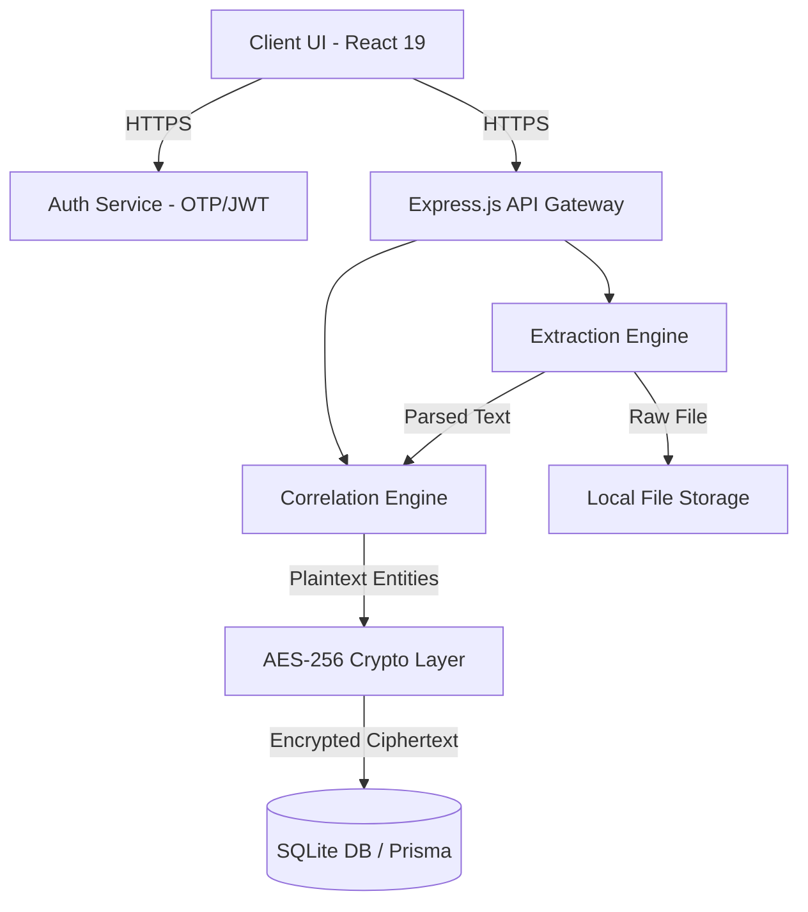
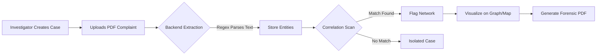
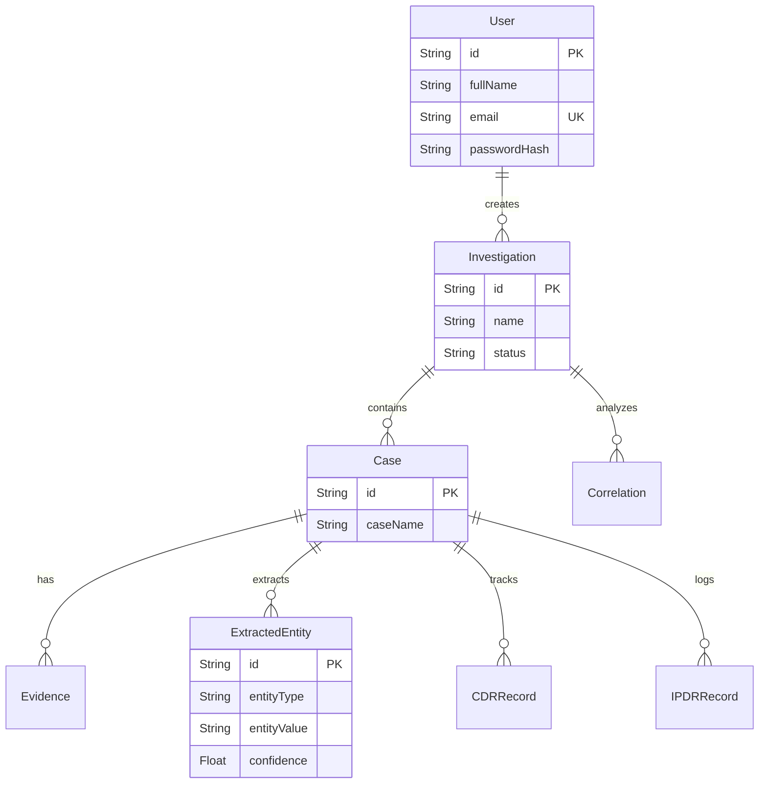
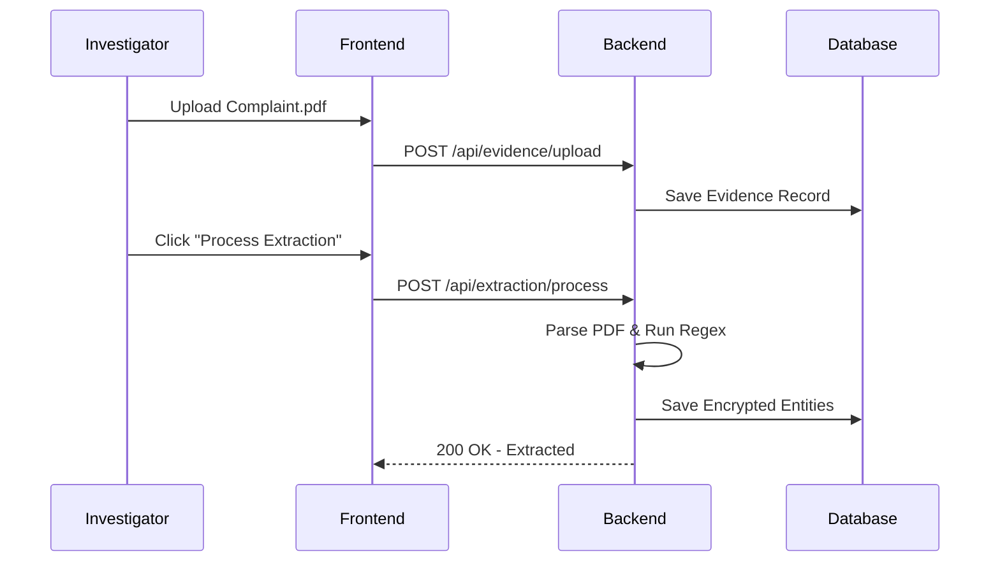

# CYBERLYNK

<div align="center">
  <h3>Advanced Cyber Crime Fraud Complaint Analysis & Correlation Engine</h3>
  <p>Automating digital evidence extraction, cross-case correlation, and suspect location tracking for modern law enforcement and cyber intelligence units.</p>
</div>

---

## Table of Contents

- [Overview](#overview)
- [Problem Statement](#problem-statement)
- [Solution Overview](#solution-overview)
- [Key Features](#key-features)
- [System Architecture](#system-architecture)
- [Project Workflow](#project-workflow)
- [Technology Stack](#technology-stack)
- [Project Structure](#project-structure)
- [Core Modules](#core-modules)
- [Database Documentation](#database-documentation)
- [API Documentation](#api-documentation)
- [Authentication & Authorization](#authentication--authorization)
- [Security Features](#security-features)
- [Data Flow](#data-flow)
- [Installation Guide](#installation-guide)
- [Environment Variables](#environment-variables)
- [Configuration Guide](#configuration-guide)
- [Usage Guide](#usage-guide)
- [Performance Considerations](#performance-considerations)
- [Testing](#testing)
- [Logging & Monitoring](#logging--monitoring)
- [Deployment](#deployment)
- [Troubleshooting](#troubleshooting)
- [Future Enhancements](#future-enhancements)
- [Contributing Guidelines](#contributing-guidelines)
- [License](#license)

---

## Overview

**CYBERLYNK** is a production-grade, highly secure intelligence platform designed for law enforcement agencies. It ingests raw digital evidence (such as PDF cyber fraud complaints and CDR/IPDR CSV dumps), automatically extracts critical entities (Phone Numbers, UPI IDs, Bank Accounts, IP Addresses), and runs an advanced correlation engine to identify overlapping data points across thousands of isolated cases. The platform maps out organized fraud rings using interactive network graphs and traces suspect movements geographically using interactive node-based maps, ultimately culminating in the generation of court-ready forensic PDF reports.

## Problem Statement

Modern cybercrime investigation divisions face severe bottlenecks:
1. **Data Silos:** Individual cyber complaints are filed in isolation. Cross-referencing thousands of PDFs manually to find a single shared hacker UPI ID is practically impossible.
2. **Manual Data Entry:** Investigators spend hours manually reading complaints and typing identifiers into spreadsheets.
3. **Complex Visualization:** Understanding the geographical movement of a suspect from raw Call Detail Records (CDRs) or visualizing network nodes requires disjointed, third-party, often non-secure software.
4. **Reporting Overhead:** Compiling all findings into a structured, professional format for warrants and prosecution takes significant manual effort.

## Solution Overview

CYBERLYNK centralizes the workflow into a single, dark-themed, distraction-free dashboard. By leveraging automated PDF parsing and Regex-based entity extraction, CYBERLYNK digitizes evidence instantly. The backend Correlation Engine actively scans the database for identical entities shared between cases, instantly flagging organized syndicates. The platform then translates this data into interactive UI components—from visual graph networks to animated geographical maps—and finally exports a strictly formatted, pristine 7-section Forensic Intelligence PDF.

---

## Key Features

### 1. Automated Entity Extraction
* **Purpose:** Digitize unstructured evidence.
* **Functionality:** Parses uploaded PDFs and uses rigorous Regex rules to extract Phones, UPIs, Banks, IPs, and Emails.
* **Inputs/Outputs:** Input: `.pdf` / `.csv`. Output: Structured `ExtractedEntity` database records.
* **Benefits:** Saves thousands of man-hours and eliminates human transcription error.

### 2. Cross-Case Correlation Engine
* **Purpose:** Uncover hidden fraud networks.
* **Functionality:** Cross-references all extracted entities within an investigation dossier.
* **Inputs/Outputs:** Input: Investigation ID. Output: `Correlation` records linking multiple Cases.
* **Benefits:** Instantly turns isolated complaints into interconnected, prosecutable conspiracy cases.

### 3. Interactive Movement Map (Suspect Tracking)
* **Purpose:** Geographically trace suspects.
* **Functionality:** Ingests CDR (Call Detail Record) data, rendering high-performance interactive maps using `react-leaflet`. Includes an animated playback engine to trace routes node-by-node.
* **Inputs/Outputs:** Input: Coordinates sequence. Output: Animated polyline/marker traversal.
* **Benefits:** Visualizes suspect routines and physical locations for targeted physical raids.

### 4. Forensic PDF Report Generation
* **Purpose:** Court-ready documentation.
* **Functionality:** Utilizes `jspdf-autotable` to dynamically construct a rigid, strictly-formatted 7-section intelligence report summarizing all evidence, hardware specs, correlations, and chain of custody logs.
* **Inputs/Outputs:** Input: Investigation State. Output: Formatted `.pdf` blob.
* **Benefits:** Instantly standardizes the output format required by prosecutors.

### 5. Encryption-at-Rest
* **Purpose:** High-grade data security.
* **Functionality:** Sensitive database fields (like raw PII) are passed through an AES-256-CBC cipher layer via Prisma extensions before hitting the SQLite disk.
* **Benefits:** Complies with strict law enforcement data protection mandates.

---

## System Architecture



### Processing Layers:
1. **Frontend:** React + Vite, styled with custom Vanilla CSS for a professional dark mode. Uses `@xyflow/react` and `react-leaflet`.
2. **Backend Gateway:** Node.js + Express handles all routing, JWT validation, and multipart form uploads (`multer`).
3. **Business Logic Layer:** Services directory containing the PDF parsers, Regex extractors, and algorithmic correlation scanners.
4. **Data Layer:** Prisma ORM interfacing with a SQLite database, wrapped in an encryption middleware layer.

---

## Project Workflow



---

## Technology Stack

| Category | Technology | Purpose |
|----------|------------|---------|
| **Frontend** | React 19, Vite, React Router | Blazing fast, modern component-based UI |
| **Mapping & Graphing**| `@xyflow/react`, `react-leaflet`| Visualizes complex data relationships and suspect movement |
| **Backend** | Node.js, Express.js | Robust, asynchronous API routing |
| **Database** | SQLite, Prisma ORM | Lightweight, highly-relational data modeling |
| **Authentication** | JWT, bcrypt, Nodemailer | Secure sessions, password hashing, and Email OTP delivery |
| **Document Parsing** | `pdf-parse`, `csv-parser` | Extracts raw text from unstructured evidence files |
| **Reporting** | `jspdf`, `jspdf-autotable` | Client-side forensic PDF generation |
| **Security** | Node `crypto` module | AES-256-CBC Encryption-at-Rest |

---

## Project Structure

```text
CYBERLYNK/
├── frontend/
│   ├── src/
│   │   ├── components/       # Reusable UI (MovementMap, ComparisonTable, Graphs)
│   │   ├── pages/            # View-level components (InvestigationDetails, Dashboard)
│   │   ├── utils/            # Client logic (pdfGenerator.js)
│   │   └── App.jsx           # Main routing layer
│   └── package.json
└── backend/
    ├── prisma/
    │   └── schema.prisma     # Database models and relations
    ├── src/
    │   ├── controllers/      # Route handlers
    │   ├── routes/           # Express router definitions (auth, cases, extraction)
    │   ├── services/         # Core business logic (Correlation algorithms)
    │   ├── utils/            # crypto.js, mailer.js, prisma.js
    │   └── index.js          # Express app entrypoint
    ├── uploads/              # Local storage for uploaded digital evidence
    └── package.json
```

---

## Core Modules

### 1. Evidence Extraction Module
* **Purpose:** Digitizes PDF/CSV files.
* **Internal Workflow:** Multer handles the multipart upload -> File saved to disk -> `pdf-parse` reads buffer -> Regex matches executed -> Prisma creates `ExtractedEntity` rows.
* **Important Functions:** `processExtraction(caseId)`

### 2. Correlation Engine
* **Purpose:** Finds overlapping case vectors.
* **Internal Workflow:** Queries all entities within an `investigationId` -> Groups by `entityValue` -> Filters groups `> 1` -> Generates `Correlation` records with confidence scoring based on data type uniqueness.
* **Important Functions:** `analyzeCorrelations(investigationId)`

### 3. Forensic PDF Generator
* **Purpose:** Standardized reporting.
* **Internal Workflow:** Takes raw React state -> Instantiates `jsPDF` -> Calculates cursor Y-axis coordinates -> Dynamically injects tables using `jspdf-autotable` with strict typography -> Prompts browser download.
* **Important Functions:** `generateInvestigationReport(data, user, correlations)`

---

## Database Documentation



* **ExtractedEntity:** The most critical table. Stores the actual intelligence vectors (Phones, UPIs, Bank Accounts).
* **Correlation:** Acts as a bridge. If an ExtractedEntity appears in >1 Case, a Correlation row is minted storing a stringified JSON array of the matching Case IDs.

---

## API Documentation

| Method | Route | Purpose | Auth Required |
|--------|-------|---------|---------------|
| `POST` | `/api/auth/login` | Authenticate user and receive JWT | No |
| `POST` | `/api/auth/register` | Register new investigator (triggers OTP) | No |
| `GET`  | `/api/investigations/:id` | Fetch full investigation state, cases, correlations | Yes (JWT) |
| `POST` | `/api/evidence/upload/:caseId` | Upload PDF/CSV evidence | Yes (JWT) |
| `POST` | `/api/extraction/process/:caseId` | Trigger regex extraction engine on case evidence | Yes (JWT) |
| `POST` | `/api/correlation/analyze/:invId` | Run cross-case correlation matrix | Yes (JWT) |

---

## Authentication & Authorization

1. **Login Flow:** User submits credentials -> Backend verifies `bcrypt` hash -> Backend generates a stateless JWT signed with `JWT_SECRET`.
2. **Session Handling:** The frontend stores the JWT in `localStorage` or memory, injecting it as an `Authorization: Bearer <token>` header via Axios interceptors.
3. **OTP:** Registration requires email verification. `Nodemailer` dispatches a secure 6-digit code.

---

## Security Features

* **Encryption-at-Rest:** Leverages Node.js built-in `crypto` to implement AES-256-CBC encryption on Prisma middleware. All sensitive text hitting the SQLite disk is ciphertext.
* **Authentication:** JWT is strictly enforced on all data routes.
* **Sanitization:** Strict payload validation to prevent SQL/NoSQL injection variants.
* **File Validation:** `multer` enforces file type (`.pdf`, `.csv`) and size limits to prevent malicious binary execution and buffer overflow DoS.

---

## Data Flow



---

## Installation Guide

### Prerequisites
* Node.js (v18+)
* npm or yarn

### Clone Repository
```bash
git clone https://github.com/your-org/CYBERLYNK.git
cd CYBERLYNK
```

### Install Dependencies
```bash
# Terminal 1 - Backend
cd backend
npm install

# Terminal 2 - Frontend
cd frontend
npm install
```

### Database Setup
```bash
cd backend
npx prisma generate
npx prisma db push
```

### Run Application
```bash
# Terminal 1 - Backend
npm run dev

# Terminal 2 - Frontend
npm run dev
```

---

## Environment Variables

**Backend (`/backend/.env`)**
```env
# Database connection string
DATABASE_URL="file:./prisma/cyberlynk.db"

# JWT Signing Secret (Must be 32+ cryptographically random chars)
JWT_SECRET="your-super-secret-key"

# Email Configuration for Nodemailer OTP
EMAIL_USER="your-email@gmail.com"
EMAIL_PASS="your-app-password"

# 32-byte hexadecimal key for AES-256-CBC Encryption-at-Rest
ENCRYPTION_KEY="your-32-byte-hex-key"
```

---

## Performance Considerations

* **Map Rendering:** The Movement Map uses heavily memoized React state and pre-calculates the `allStops` array to ensure node-by-node 700ms playback runs at a locked 60FPS without React reconciliation lagging.
* **Correlation Speed:** To avoid `O(N^2)` bottlenecks, entities are grouped via database-level `GROUP BY` strategies (or heavily optimized memory maps) rather than nested `for` loops.

---

## Troubleshooting

**Q: The PDF Report Generator crashes or outputs blank.**
* **Cause:** `jspdf-autotable` Vite bundling issue.
* **Fix:** Ensure you are using the explicit ES module import `autoTable(doc, {...})` as currently implemented, rather than attempting to mutate the `jsPDF` prototype.

**Q: Login fails immediately.**
* **Cause:** Missing `JWT_SECRET` in the backend `.env`.

---

## Future Enhancements
* **PostgreSQL Migration:** Transition from SQLite to PostgreSQL for massive horizontal scaling.
* **Web Workers:** Shift PDF rendering and large Regex extraction loops to background Web Workers to prevent main-thread UI locking on 10,000+ page datasets.
* **Telecom API Integration:** Integrate directly with telecom providers to auto-fetch CDRs via secure tunneling, bypassing the need for CSV uploads.

---

## License
Proprietary / Restricted. For Law Enforcement and Authorized Personnel Use Only.

---

## Contact Information
For system deployment support or to report security vulnerabilities, please contact the internal Cyber Intelligence IT division.
